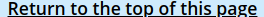
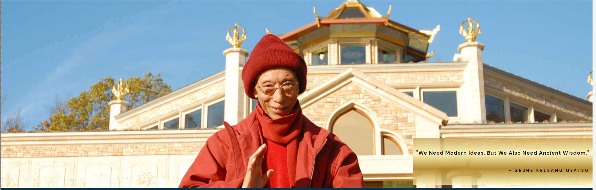
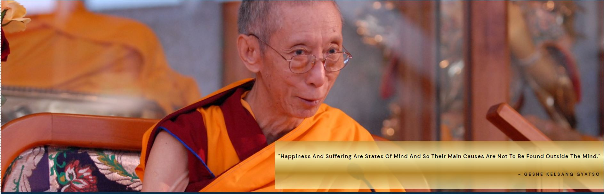
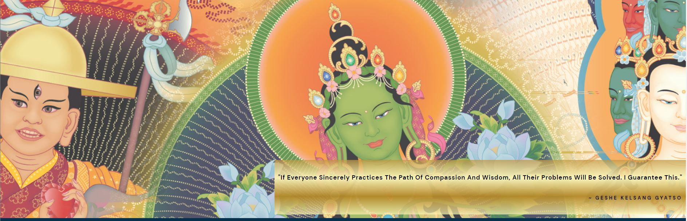
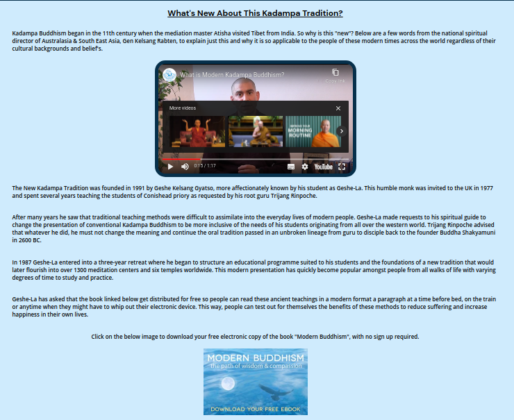
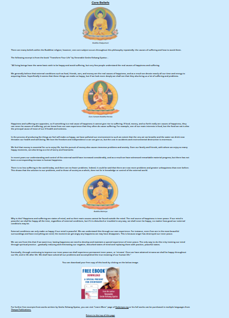
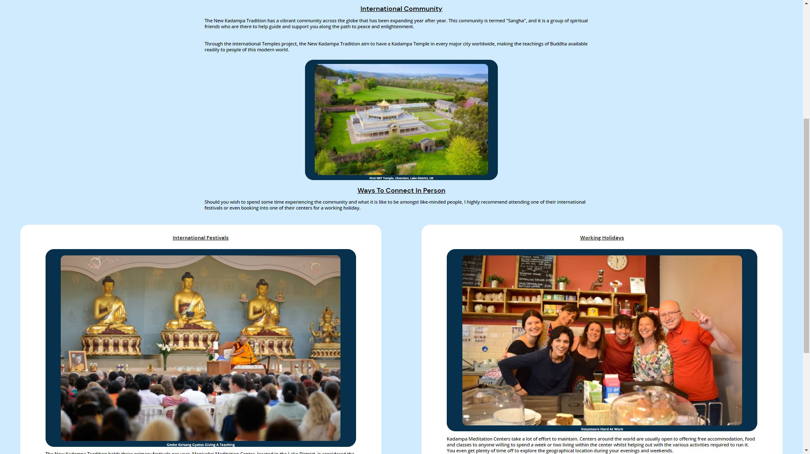
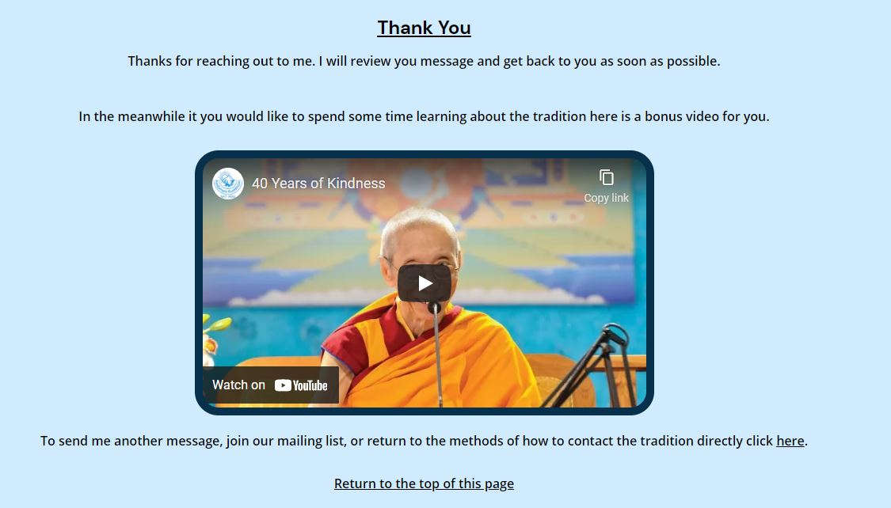

# **Modern Buddhism**

## **Site Overview**
***
The New Kadampa Tradition (NKT) is a modern form of Buddhism without any cultural influence from the east. It stems from Tibetan Buddhism, which is publicly known in the west but is more accessible to people with a busy lifestyle. It removes a lot of the cultural aspects of the Tibetan nations and provides everything in English.  Typically when someone wishes to learn the teachings from the Tibetan schools, they would be required to learn Tibetan and perform lengthy rituals to gain the full benefit of the practice.  The founder of the NKT, Geshe Kelsang Gyatso saw that cultural influences from Tibet were an obstacle to western practitioners and worked diligently to create a structure that was more suited to modern life.

## **Planning stage**
***
### **Who Is The Site Intended For? (Target Audiences):**
* Users craving to be happy yet have failed to find the answers outside in the world outside of themselves. 
* Users with a general interest in Buddhism and want to learn more.
* Users who have never heard of the NKT.
* Users who have heard of the NKT but would like to find more information on the tradition.

### **User Story's:**
* As a user I want to be able to see clearly what the page is about.
* As a user I want to be able to easily navigate the page to find what I require.
* As a user I want to be able to leave feeling like I knew more that I did when I arrived at the site.
* As a user I was to be able to easily navigate my way to free resources
* As a user I want to be able to reach out and connect to discuss/experience the subject matter on a deeper level. 

### **Site Aims:**
* To educate the user on the NKT.
* To educate the user on the core value of Buddhism.
* To offer the user a chance to connect to the international community in person.
* Provide the user with the information required to check for a base of operations close to them.
* To offer the user a to contact the site author for further info or discussion.
* Provide a method by which the user can subscribe to a newsletter.

### **How Is This Will Be Achieved:**
* The home page provides the user with a summary of the tradition, how it is suitable for modern people and how the NKT came to be.

* The site will provide multiple free resources such as 
    * Two free e-books with an excerpt used on the teaching page to highlight a core concept in Buddhism.
    * Links to further free resources via the NKT's own homepage and their social media pages. 
    * Embedded YouTube videos.

* The site will provided information on the options available to engage with the international community.
    * Working holidays.
    * International festivals.

* The site provides a link to a meditation center locator tool hosted on Kadampa.org. 

* If the user is in a country or region without a nearby centre, or wishes to speak to someone informally about the subject I have included a contact form to connect the site author directly. The reason for this also relates to the [Future-enhancements](#future-enhancements) section listed later in this readme. 

* Providing a newsletter to which the user can subscribe whilst sending the site author a message our else by omitting the message and selecting the relevant option before clicking the submit button.

### **Wireframes:**
To organize my thoughts and prevent scope creep I decided to create wireframes even though they were not specifically required to this project. Below are links to each of the mobile and desktop versions of the 4 intended pages. 

* Mobile Wireframes:
    * [Homepage (About)](assets/readme/wireframes/homepage-mobile.png)
    * [Teachings page](assets/readme/wireframes/teaching-mobile.png)
    * [Community page](assets/readme/wireframes/community-mobile.png)
    * [Contact page](assets/readme/wireframes/contact-mobile.png)

* Desktop wireframes:
    * [Homepage (About)](assets/readme/wireframes/homepage-desktop.png)
    * [Teachings page](assets/readme/wireframes/teaching-desktop.png)
    * [Community page](assets/readme/wireframes/community-desktop.png)
    * [Contact page](assets/readme/wireframes/contact-desktop.png)

During the project there was some deviation from the original wireframes in order to improve the User Experience (UX) as a whole. Such deviations include: -

* The inclusion of a hero image and quote on each page to improve uniformity across all pages.
* Images were used on the teaching page to break up the text.
* Headings and content placement to allow for the flow of information to be relevant.
* A second logo was added to the header on larger screens to add symmetry and make the design more appeasing to the eye.
* The two boxes in the footer were originally intended to be the images for the e-book downloads used in the final design. This idea was abandoned as not to increase the footer height to much on mobile devices and to improve the flow of information as the user progressed through the pages.

### **Color Scheme:**
When deciding the color scheme I wanted to go with something that gave an elegant appearance. For this reason I selected a range of blue and gold's and used the following color grid created on https://contrast-grid.eightshapes.com/ to check the contrast scores. This allowed me to ensure all text remained visible and the site was accessible to all.

## **Current Features Common to all pages**
***
###  **Header Element**
***
The header element contains the following features: 
#### *Title:*

* The title serves to clearly state the name of the tradition.
* It also serves as a navigation link to the home page in this case called "about" as per the well establish convention expected by the user.

#### *Logos:*
* The logos are to illustrate the subject of the site, as well as to offer something to appease the users eye filling the blank space without distracting from the title.

    * One logo on mobile devices was to ensure the title stays as big as possible on a smaller screen there by improving the user experience.

        

    * Two logos on larger screens gave better symmetry to the header whilst filling the excess white space provided by a wider screen size.

        

### **Site Navigation**
***
#### *Navigation Bar:*
* The navigation bar appears on all five pages (including the form feedback page). 
* It contains links to the about, teachings, community and contact page to allow easy navigation around the website. 
* The below image shows the current page being visited by the user highlighted in blue with a white border. 
* This blue highlight with white border is also mimicked on the hover over feature for the other nav bar buttons.

#### *Return To Top Of The Page Link:*
* In addition, to the navbar, each page includes a hyperlink at the bottom of the content. "Return to top of the page" takes the user back to the navigation bar if they have had to scroll a long way down to read all the content. 
* This is especially useful on mobile devices where the column width for the content is narrower.\

### **Hero Images**
***
* I have included a hero image on each page to make the site uniform across all pages. 
* Each image has a zoom animation to grab the attention of the user. 
* Each image has an overlaid a quote designed to give the user a brief insight into the teachings of the NKT.

### **About Page**:
#### *Hero-Image:*
The hero image depicts Geshe Kelsang Gyatso, who was the founder of the New Kadampa Tradition. He is smiling and waving as if welcoming the user to the page. Behind him is the primary temple of the tradition, which holds great significance to the tradition. The temple pictured hosts two the the traditions international festivals and is within the grounds of Manjushri Meditation center, considered the hub of the NKT's international operations.

#### *Quote:*
The quote included on the about page is "We Need Modern Ideas, But We Also Need Ancient Wisdom.". This perfectly sums up the subject matter of the page which begins with what the NKT is about.

### **Teachings page**:
#### *Hero-Image:*
This image is Geshe Kelsang Gyatso sat on what is commonly called a throne at one of the traditions international festivals. The throne is where a teacher sits to expound the oral lineage past from teacher to disciple, and so it was appropriate for a page discussing the core beliefs of the philosophy in his own words.

#### *Quote:*
The quote included on the teachings page is "Happiness And Suffering Are States Of Mind And So Their Main Causes Are Not To Be Found Outside The Mind." which is not included in the excerpt on the page below it, however compliments the subject matter.

### **Community page:**
#### *Hero-Image:*
This image is a view from behind Geshe Kelsang Gyatso teaching at one of the NKT's fall festivals. It was chosen to show the extent of the international community attending one of these events.

#### *Quote:*
The quote on the community page is "Buddha is the doctor who gives us medicine, and the Sangha are the nurses who assist us." The word Sangha is defined in the content of this page and serves to show the importance and function that community serves within the NKT.

### **Contact and Form-Feedback pages:**
These two hero images and quotes we kept as the same to simulate still being on the same page after the form has been submitted.
#### *Hero-Image:*
The artwork pictures 3 of the common deities used within the New Kadampa Tradition. I used this to be eye-catching even when viewed from smaller devices.

#### *Quote:*
The quote used for these two pages is "If everyone sincerely practices the path of compassion and wisdom, all their problems will be solved. I guarantee this.". It was chosen as encouragement for people to reach out to either myself or their local community to find out more about the tradition and their teachings.

## **Anchor Tags Within A Pages Main Content**
***
* All anchor tags in the main content of the page were left with the underline decoration to make it clear that their was a hyperlink embedded.  
* The color was change to black changed to match the surrounding text. This meant the anchor tag did not look out of place or ruin the contrast score on the text across the blue background.
* Have a hover over effect which turn them one of the darker colors from the gold gradient used throughout the page.
* Have the cursor set to pointer. This is actually a browser default setting however I noted it was not default for buttons. I added cursor: pointer rule to the styles.css for the form submit button however I decide to create a separate rule for a:hover just in case the browser default was ever changed.

## **Footer**
***
* The footer include directs links to all the NKT's social media accounts with an invitation for the user to connect to the NKT directly via these channels.

* I have also included a disclaimer that the site has been produced for educational purposes only and that all images and videos remain the property of NKT-IKBU.

## **Individual Page Content features**
***
### **About Page Content:**

* This page gives a brief historical summary of the New Kadampa tradition, a quick overview of how the NKT came to be.
* The embedded youtube video is of one of the traditions senior teachers giving a summary of what modern Buddhism is to the tradition. 
* At the end of the content, there is an anchor tag wrapped around an image so the user can download a free copy of one of Geshe Kelsang Gyatso's books called "Modern Buddhism" in electronic format.

### **Teachings Page Content:**
* Includes an exert from the downloadable e-book "Transform Your Life" by Geshe kelsang Gyatso. 
* Covers the core beliefs behind what Buddhism teaches. 
* Images were included to break up the monotony of the long passage.  
* The images are symbolic of the traditions linage and are the kind of decorations used in Geshe Kelsang Gyatso's books between pages. 
* Images are wrapped in a figure element and gaven a figcaption so the user know who the image portrays. *Note: (It was outside the scope of the projects MVP to go into detail of the full linage of the NKT but I have included this to be added in the [Future-Enhancements](#future-enhancements) section of this readme.)*
* The last image towards the bottom of the page is wrapped in an anchor tag. The image contains text inviting the user to download a full copy of the book if the user wishes to read further. 
* Link provided for further free excerpts from Geshe Kelsang Gyatso's books via an external site.  
* Link provided to Tharpa publications run by the NKT where the users can purchase the full range of Geshe Kelsang Gyatso books and materials, including Buddhist prays and artwork approved by the tradition. 

### **Community Page Content:**

* Begins by explaining the terminology used in the hero image quote. This explanation then introduces the NKT's international community and their goal to achieve the accessibility of Buddha's teachings to people worldwide.
* The user is presented two methods to connect directly with the international community and further their experience of Modern Buddhism.

*Note: Due to the size of this page I was unable to get a full screenshot to include the text in the two split articles. The only thing missing is the text of the article and features covered elsewhere in this readme. For a full view of these articles you can view this page on the deployed site https://dnlbowers.github.io/modern-buddhism/community.html*

### **Contact Page Content**
* Reiterates ways to reach out to the New Kadampa Tradition in the user's local area and refers them back to the ways to connect section on the community page.
* User is offered a way for the user to contact me as the site author should they wish to discuss the subject matter further. This section includes a short biography about me and my experience in the NKT.
* Form used has three required fields. 
    * The first two are name and email so that I know who is sending the request and to where I should return the appropriate response. 
    * The third required field are the two radio buttons which are both linked via the attribute value name="mailing_list". The user must select one of these options to click submit and cannot select both.
* In between these required fields is an optional textarea so the user can choose to send me a message.  
* In addition to the afore mentioned pointer: cursor; feature when hovering over any anchor element on the site the submit button also have a shimmer effect as feedback when the user hovers their cursor over it. 

*Note: This from doesn't function to gather any data, it was created with a GET request to call a feedback page. The submit button then triggers the GET request to load the form feedback page outlined later in the readme. This feature is to simulate a real functional form only.*

### **Form Feedback Page Content**
* This page was created to mimic the effect of actually submitting a form. 
* Text alignment on this page is set to center as with so little text it looked odd using the same as the other pages which are set to justify on smaller screens and left on larger ones. 
* Since filling in the form suggests the user is interest in learning more I have included a longer feature video about the tradition here. *Note: Originally I had wanted to use this on the home page but due to the length of the video I deemed it to long for an introduction. There is no auto play on the videos so the user can choose whether they want to engage with the video or not.*
* Link included within the content to take the user back to the real contact page. This is in case they wanted to look at the ways to contact a local meditation center, send an additional message, or sign up to the mailing list.

## **Future-Enhancements**
***

The future intention of the site would be to serve as a website specifically for Malta, where there is no community until now. However, Due to the summer break, which the tradition undergoes every year, I could not reach the traditions director with my request for permission. I decided to build a tribute site to showcase to the head office and adapt the content to be more Malta specific later on. 

At first, the purpose would remain to educate and raise awareness meaning the current content would still be applicable; however, There would be additional content I could add as interest grew. Such things would be: -

* Times/dates/venues for Meetups in Malta to build a community
* Times/dates/venues for Book clubs to study and discuss the materials and methods to apply them to daily life.
* More information on the lineage of the tradition to include short biographies.

Eventually, when Malta was designated, a teacher by the head office these would then convert into: -

* Times/dates/venues/fees for Formal classes
* Times/dates/venues/fees for Public talks/events
* Include a bio for Malta's officially designated teacher at the end of the traditions lineage page or add to a new page that summarizes their experience.

Once I better understand Javascript, I would like to add a burger menu for mobile-sized device screens. I found articles on how to achieve this with CSS and HTML alone; however, I did not deem this necessary to create the minimum viable product.

I would also make the contact form fully functions with a post request and have a database in place to collate data for the mailing list.