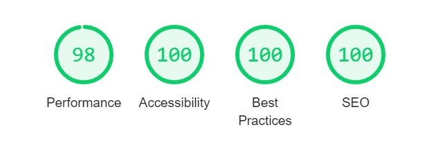
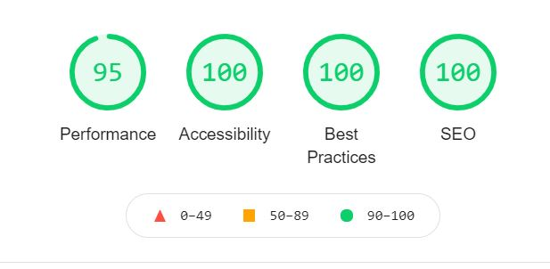

## **During Development Testing**
***
During the development process, I was manually testing in the following ways:-

1. Manually testing each element for appearance and responsiveness via a simulated live server using an extension in VSCode.
    
1. Published the page via GitHub pages and shared with fellow students to test and received feedback.

#### ***Manual Testing:***
During testing, I used four different browsers to ensure cross-compatibility. The desktop browsers used by myself were:

1. Chrome
2. Firefox  
3. Opera
4. Edge

I then used the devtools to simulate different screen sizes/devices from 320 px upt 4000px in width. 

In addition to this, I also asked several people to test using iPhones and Apple Mac laptops/desktops using safari. These users reported no issues or bugs.

Below is a list of bugs I found during the development process by testing myself via the live server extension on VSCode. I tried each element for how the browser would display the page to potential users on a range of different screen sizes.:-

1. **Intended Outcome** - A header with three evenly spaced out items across the header element.
    * ***Issue Found:*** 
        * Using float left and float right, I found the title stuck to the logo on the left despite using the clear command in the CSS .title selector.
    * ***Solution Used:*** 
        * Used CSS flex instead of float.
1. **Intended Outcome** - Buttons of the navigation menu buttons to touch when active or hovered over whilst still having an adequate spacing between the text.
    * ***Issue Found:*** 
        * Initially using flex, I had the elements spaced evenly. When placing the elements contained in the navbar to the center they the text appeared to close together.
    * ***Solution Used:***    
        * I resolved this by using padding on the anchor tag text whilst keeping the elements centred using flex. 
1. **Intended Outcome** - A fully responsive Nav bar suited to all screen sizes.
    * ***Issue Found:*** 
        * On smaller screen sizes, there was a horizontal scroll bar in the browsers dev tools.
    * ***Solution Used***:
        * Resolved by slightly reducing the font size in the nav-menu class. 
        * Increasing the top and bottom padding by one 1px for the Nav-button class to maintain the background of the .active and nav-button: hover spanning from top to bottom of the navbar. 
1. **Intended Outcome** - A hero image to span the entire width of the page and be fully responsive across all screen sizes.
    * ***Issue Found:*** 
        * Some images appeared pixelated when stretching to the required size.
    * ***Solution Used:*** 
        * In some cases, I found higher resolution versions of the image that resolved the issue. 
        * In other cases, no higher resolution version of the selected image was available, and I had to choose a new image for the pages hero image.
1. **Intended Outcome** - Aligned contact form with all elements looking uniform and neat.
    * ***Issue Found:*** 
        * When using CSS grid to align the form, I could not align the radio buttons and labels properly.
    * ***Solution Used:***
        * I wrapped inputs and labels from the mailing list section of the contact in a div element.
1. **Intended Outcome** - When screen sizes exceed 768px in width, the two articles on the community page display side-by-side.
    * ***Issue Found:***
        * When getting to around 2600px, the heading would move to the side of the articles.
    * ***Solution Used:***
        * I split the page's content into separate sections, so the two articles were separate from the introduction paragraph with the heading "ways to connect in person". The way I divided the content later caused an issue on post-development testing that I will discuss later in this document.
1. **Intended Outcome** - Social media link displayed in a line side by side in the footer.
    * ***Issue Found:***
        * One of my fellow students noted there was an underscore between elements. The underscore was due to the way I wrote the HTML with the parents and child elements onto separate lines to improve the readability of my documents.
    * ***Solution Used:***
        * By placing the anchor tag and the font awesome "i" tag on the same line, the underscore disappeared.
1. **Intended Outcome** - A seamless transition between pages with the active tab and the hover feature looking smooth.
    * ***Issue Found:***
        * A fellow student pointed out that the nav buttons appeared to jump around when switching pages as the active tab switched from one button to the next.
    * ***Solution Used:***
        * By placing a transparent border around all nav-button elements, I resolved the issue.
1. **Intended Outcome** - All Figure elements are fully responsive.
    * ***Issue Found:***
        * When increasing the screen size on the community page, I found that the figure elements in the last two articles and their contained images were increasing but not proportionately to each other.
    * ***Solution Used:***
        * Wrapping the last two figure elements on the community page in a div.
1. **Intended Outcome** - Clear and consistent commit messages.
    * ***Issue Found:***
        * Looking back over my past commits, I found a Ghost author listed earlier in the commit history. A google search showed that this represented a deleted account.
    * ***Solution Used:***
        * There was no fix required. I found this issue was caused by using the VSCode app on my work laptop instead of GitPod IDE. I set up VSCode because I needed a way to work whilst offline during a flight to Scotland. It wasn't until I returned home and set VSCode up on my private laptop that I realized I made all commits during my trip using my work email and username as a default to the VSCode preinstalled by my company. Once I updated my user details within VSCode, this ghost author appeared in the commits.  My work laptop somehow later restored my work email as the VSCode user during the project's final stages. However, I managed to link my work email to my Github account this time, so there will be no future inconsistency in the author of a commit.

    
## **Post Development Testing**
***
### **Validators**

#### ***HTML*** - https://validator.w3.org/nu/

* ***Issue Found:***
    * My solution to point 6 of the "During Development Testing" section cause an error because I used a semantic tag ("section") on the community page with no heading. I had originally split the page into three sections leaving the two articles in a section by themselves. 
* ***Solution Used:***
    * I extended the section with the ID "ways-to-connect" to include the articles on the page and nested the section containing the two articles into a div element within #ways-to-connect. All pages now return no error.

#### ***CSS*** - https://jigsaw.w3.org/css-validator/

* All pages tested, no issues found via URL or file upload.\

### **Lighthouse Scores**
***
### **Test conditions**
I did all lighthouse tests in incognito mode to avoid interference from browser extensions. 
I ran the tests for both mobile and desktop. 
#### ***Desktop Version:***

I have only included one screenshot for desktop as all pages were the same score, only changing by one or two points in performance if I ran it multiple times. 

 

**There were several actions required to get to this score:**

1. The initial SEO score was 90 due to having no Meta description tag in the page head. Once I added this, the score became 100.

1. The best practice score was first 93 and impacted by three factors:
    * Aspect ratio of the images on the teachings page. I fixed this by resizing the images proportionately with the calculator found on https://andrew.hedges.name/experiments/aspect_ratio/.

    * There were some anchor tags on the community page and the form feedback page where the text was "here". I changed these anchor texts to a more descriptive text indicating where the links would lead the user.

    * The graphic used as an anchor to download the book Modern Buddhism on index.html was the correct size with no need to specify width and height. However, the best practice scored suggested it should have a height and width specified. I used an extension called pesticide to get the dimension of the image and added these to the CSS file under an ID explicitly created for this element (#modbudd-ebook). Once I added the dimensions best practice score became 100.

1. The performance was 93 on the form feedback page but fluctuating around 93 each time I ran the test. I used https://tinypng.com/ to compress the hero image on this page, which took the score to a minimum of 95 or higher each time I ran the lighthouse test.

#### **Mobile Version:**

Due to the more significant variance in the performance score, I have included a screenshot for each mobile page.

1. ***index.html:***

     

    * Originally, the performance score on the page was around 83. But by using a slightly smaller version of the same hero image, I resolved the issue and maintained the responsiveness up to 4000 px in width.

1. ***teaching:***

    

1. ***community.html:***

     

1. ***Contact.html:***

    

    * Best practice score has initially been 98 due to the spacing of the mailing list radio buttons. I added a padding bottom to the top div encasing the first input and label, which solved the issue.
    * The performance score is lower on this mobile page due to the hero image. I already compressed the image twice, which had little impact on the score, and unfortunately, there was no more petite version of the image available. To resolve this in the future, I intend to use GIMP to resize an image. However, it was not a viable solution for this project due to the time already spent on the project, given I would need to learn GIMP from scratch. 

1.  ***form-feedback.html***

     
    * I found the performance score on this page lower due to the embedded video. I discovered this by looking at the original trace in the browser dev tools and saw the pages hero image and content loaded quickly. To test this theory, I removed the link from the iframe, and sure enough, the score increased a few points.
