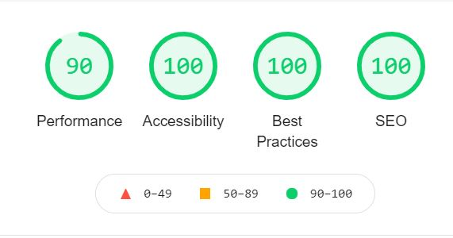

## **During Development Testing**
***
During the development process I was manually testing in the following ways:-

1. Manually testing each element for appearance and responsiveness via a simulated live server using an extension in VScode.
    
1. Published the page via github pages and shared with fellow students to test and received feedback.

#### ***Manual Testing:***
During testing I used 4 different browsers to ensure cross compatibility. The desktop browsers used by myself were:

1. Chrome
2. Firefox  
3. Opera
4. Edge

I then used the devtools to simulate different screen sizes/devices from 320 px upt 4000px in width. 

I also asked several people to test on iPhones and Mac laptops/desktops using safari and no issues or bug were reported.

Below is a list of bugs I found during the development process by testing myself via the simulated live server extension on VScode. Each element was tested for how the elements would be displayed to a potential user and a range of different screen sizes.:-

1. **Intended Outcome** - A header with three elements evenly spaced out across the header element.
    * ***Issue Found:*** 
        * Using float left and float right I found the title was sticking to the logo on the left in spite of using the clear command in the CSS title selector.
    * ***Solution Used:*** 
        * Used CSS flex instead of float.
1. **Intended Outcome** - Buttons of the navigation menu buttons to touch when active or hovered over whilst still having adequate spacing between the text.
    * ***Issue Found:*** 
        * Initially using flex I had the elements spaced evenly. When placing the elements contained in the nav bar to centre they the text appeared to close together.
    * ***Solution Used:***    
        * This was resolved by using padding on the anchor tag text whilst keeping the elements centred using flex. 
1. **Intended Outcome** - A fully responsive Nav bar suited to all screen sizes.
    * ***Issue Found:*** 
        * On smaller screen sizes there was a horizontal scroll bar in the browsers devtool.
    * ***Solution Used***:
        * Resolved by slightly reducing the font size in the nav-menu class. 
        * Top and bottom padding by one 1px for the Nav-button class in order to maintain the background of the .active and nav-button:hover spanning from top to bottom of the nav bar. 
1. **Intended Outcome** - A hero image to span the full width of the page and be fully responsive across all screen sizes.
    * ***Issue Found:*** 
        * Some images appeared pixelated when stretch to the required size.
    * ***Solution Used:*** 
        * In some cases I was able to find higher resolution versions the image which resolved the issue. 
        * In other cases no higher resolution version of the selected image was available. In these cases I had to choose a new image for the pages hero image.
1. **Intended Outcome** - Aligned contact form with all elements looking uniform and neat.
    * ***Issue Found:*** 
        * When using CSS grid to align the form the radio buttons and their labels were not aligned properly.
    * ***Solution Used:***
        * Wrapped inputs and labels from the mailing list section of the contact in a div element.
1. **Intended Outcome** - When screen sizes exceed 768px in width the two articles on the community page would display side by side.
    * ***Issue Found:***
        * When getting to around 2600px the heading would move to the side of the articles.
    * ***Solution Used:***
        * The content of the page was split into separate sections so the two articles were separate from the introduction paragraph with the heading "ways to connect in person" . This later caused an issue on post development testing which will be discussed further down in this document.
1. **Intended Outcome** - Social media link displayed in a line side by side in the footer.
    * ***Issue Found:***
        * It was noted by one of my fellow students there was an underscore between elements. This was due to the way I have the parents and child elements onto separate line in an attempt to improve readability of my HTML documents.
    * ***Solution Used:***
        * By placing the anchor tag than the font awesome "i" tag on the same line the underscore disappeared.
1. **Intended Outcome** - A seemless transition between pages with the active tab and the hover feature looking smooth.
    * ***Issue Found:***
        * A fellow student pointed out that when switching pages the nav buttons appeared to just around as the active tab switched from one button to the next.
    * ***Solution Used:***
        * By placing a transparent border around all nav-button elements the issue was resolved.
1. **Intended Outcome** - All Figure elements are fully responsive.
    * ***Issue Found:***
        * When increasing the screen size on the community page I found that the figure element and its contained image where increasing but not proportionately.
    * ***Solution Used:***
        * Wrapping all figure elements on the community page in a div element.
1. **Intended Outcome** - Clear and consistent commit messages.
    * ***Issue Found:***
        * Looking back over my past commits I found that there was a Ghost author listed earlier on in the commit history. A google search showed that this represented a author who's account had been deleted.
    * ***Solution Used:***
        * There was not fix required. I found this issue was caused by using the VScode app on my work laptop instead of gitpod IDE. The reason I set up vscode is I needed a way to work whilst offline during a flight to Scotland. It wasn't until I returned home and set vscode up on my personal laptop that I realized that all commits from VScode made were being made using my work email and username. Once I updated my user details within VScode this ghost author appeared in the commits.  
    
## **Post Development Testing**
***
### **Validators**

#### ***HTML*** - https://validator.w3.org/nu/

* ***Issue Found:***
    * My solution to point 6 of the "During Development Testing" section cause an error because there was a semantic tag (section) used on the community page with no heading. I had originally split the page into 3 sections leaving the two articles in their own section. 
* ***Solution Used:***
    * I extended the section with the ID "ways-to-connect" to include the articles on the page and turned the section containing the two articles into a div element. After this no errors were found by the validator.

#### ***CSS*** - https://jigsaw.w3.org/css-validator/

* All pages tested, no issues found via URL or file upload.\

### **Lighthouse Scores**
***
All lighthouse tests were done in incognito mode to avoid interference from browser add ons. I ran the tests on for both mobile. For desktop I have only included one screenshot as all pages were the same score, only changing by 1 or two point in performance if I ran it multiple times. 
#### ***Desktop Version:***

I tested all pages with on desktop and found the scores all to be the same so only one image has been included.

 
There were several actions required to get to this score.

1. The initial SEO score was 90 due to having no Meta description tag in the page head. Once this was added the score became 100.

1. The best practice score was first 93 and impacted by three factors:
    * Aspect ratio of the images on the teachings page. This was fixed by resizing the images with the calculator found on https://andrew.hedges.name/experiments/aspect_ratio/.

    * There where some anchor tags on the community page and the form feedback page where the text read only "here". These were changed to a more descriptive text indicating where the links would lead the user.

    * The size of the image to download the book Modern Buddhism on index.html was the right size. However, best practice suggest ti should have a height and width specified. I used an extension called pesticide to ge the images dimension and added these to the css file under an ID created for this element (#modbudd-ebook).

1. The performance was 93 on the form feedback page but fluctuating around 93 each time I ran the test. I used https://tinypng.com/ to compress the hero image on this page, which took the score to 95 or higher each time I ran the lighthouse test.
#### **Mobile Version:**

Due to the larger variance in the performance score I have included a screenshot for each mobile page.

1. ***index.html:***

     

    * Originally the performance score on the page was around 83. But making using a slightly smaller version of the same hero image the issue was resolved.

1. ***teaching:***

    

1. ***community.html:***

     

1. ***Contact.html:***

    

    * Best practice score was originally 98 due to the spacing of the mailing list radio buttons. I added a padding bottom to the top div encasing the first input and label which solved the issue.
    * The performance score is lower on this mobile page due to the hero image. It has already been compress twice and unfortunately the was no smaller version available. To resolved this in the future I intend to learn how to use GIMP however for the purpose of this project the was not the available. 

1.  ***form-feedback.html***

     
    * I found the performance score on this page lower due to the you tube embedded video. I discovered this by looking at the original trace in the browser dev tools and saw the page content loaded quickly. To test this theory I removed the link from the iframe and sure enough the score increased a few points.